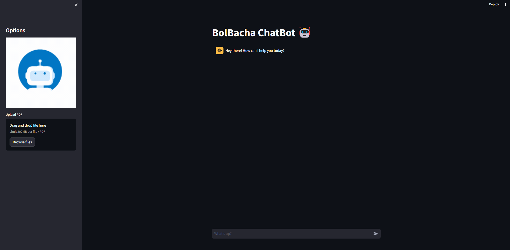
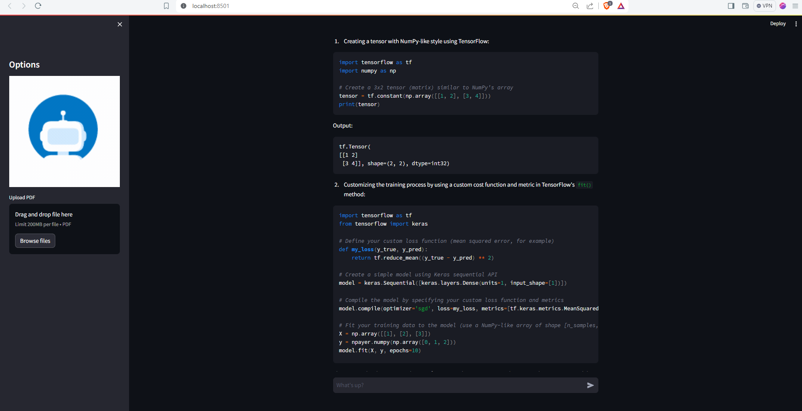

# BolBacha ChatBot 🤖

BolBacha is an AI-powered chatbot built on the concept of Retrieval-Augmented Generation (RAG). It utilizes RAG, CHROMA, and OLLAMA with Model phi3 3.6 Billion parameters to provide interactive conversations and information retrieval capabilities.

## Retrieval-Augmented Generation (RAG) 🧠

RAG is a novel approach to conversational AI that combines the benefits of information retrieval with the flexibility of generative models. It allows the chatbot to retrieve relevant information from a large knowledge base and generate responses based on retrieved information.

## Setting Up the Virtual Environment 🛠️

To set up the virtual environment for BolBacha, follow these steps:

1. Clone the repository: `git clone https://github.com/husnainsr/BolBacha.git`
2. Navigate to the project directory: `cd BolBacha`
3. Create a virtual environment: `python3 -m venv venv`
4. Activate the virtual environment:
   - On Windows: `venv\Scripts\activate`
   - On macOS and Linux: `source venv/bin/activate`
5. Install dependencies from requirements.txt: `pip install -r requirements.txt`

## Frontend Interface 🌐

BolBacha's frontend interface is built using Streamlit, a popular Python library for creating interactive web applications. Users can upload PDF documents and engage in conversations with the chatbot.

To run the frontend interface:

1. Make sure the virtual environment is activated.
2. Navigate to the directory
3. Open a new Terminal and connnect to the Ollama Server `ollama run phi3`
4. Run the Streamlit app: `streamlit run app.py` or `streamlit run frontend.py`

This will start a local server hosting the BolBacha frontend interface. You can access it in your web browser at `http://localhost:8501`.

## Features of BolBacha 💬

- **Interactive Conversations:** Engage in natural conversations with BolBacha powered by advanced AI models.
- **Document Analysis:** Upload PDF documents to extract information and discuss its contents with BolBacha.
- **Information Retrieval:** BolBacha can retrieve relevant information from a vast knowledge base to answer your queries.
- **User-friendly Interface:** The frontend interface is intuitive and easy to use, making interactions with BolBacha seamless.

## Frontend 🙌

